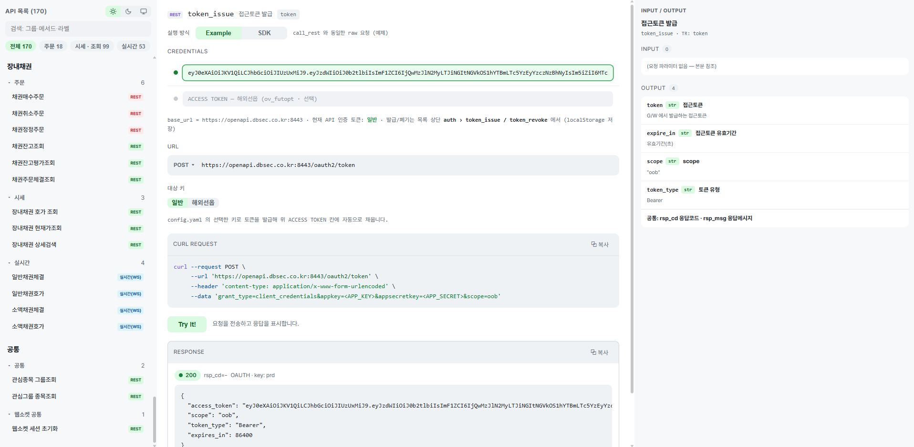

# DB증권 OpenAPI · 웹 테스터 (Try It)

DB증권 OpenAPI 전체 API를 **웹에서 버튼 한 번으로 실행**해 보는 로컬 페이지입니다.
(좌: API 목록 · 중앙: CREDENTIALS·URL·cURL·RESPONSE · 우: In/Out 필드 명세)



## 실행

```bash
# 저장소 루트에서 실행하는 경우
python web_test/server.py

# web_test/ 폴더 안에서 실행하는 경우
python server.py

# → 둘 다 http://127.0.0.1:8765  (브라우저로 열기)
```

> 실행 위치와 무관하게 동작합니다 - `server.py` 가 자기 파일 위치로 저장소 경로를 계산합니다.

- **인증은 access token 입력** 방식입니다 - key/secret 은 헤더에 싣지 않습니다.
  CREDENTIALS 칸에 토큰을 붙여넣으면 `Authorization: Bearer <token>` 으로 호출합니다.
- 토큰 칸은 **일반(실전) / 모의투자 / 해외선옵** 3개이며, 발급/폐기는 API 목록 최상단
  **인증 › 접근토큰 발급/폐기** 에서 대상 키(일반/모의투자/해외선옵)를 선택해 실행합니다.
  각각 `config.yaml` 의 `prd_*` / `vtl_*` / `ov_futopt_prd_*` 키를 사용합니다
  (키는 서버에만 있고 페이지로 전송하지 않음).
- CREDENTIALS 상단의 **실행 환경(실전/모의투자)** 토글로 호출에 쓸 토큰을 선택합니다.
  - REST 는 운영/모의 URL 이 동일해 **어느 토큰을 쓰는지가 환경을 결정**합니다.
  - WebSocket 은 모의 선택 시 모의 전용 포트(17070)로 접속합니다.
  - 해외선옵(`ov_futopt_*`)은 DB증권이 모의투자를 제공하지 않아 토글과 무관하게
    항상 해외선옵 토큰을 사용합니다.
  - 모의 미지원 API(지원 매트릭스 기준)를 모의 환경에서 선택하면 경고가 표시됩니다.
- 입력한 토큰은 이 브라우저(localStorage)에만 저장됩니다.

## 구성

| 파일 | 역할 |
|---|---|
| `server.py` | 로컬 프록시 - 토큰 발급 + DB API 대리 호출(REST) + WebSocket 프로브. stdlib만 사용 |
| `catalog.py` | 예제(call_rest/ws_subscribe)를 모킹 import 해 전체 API 목록·기본 body 생성 |
| `index.html` | 다크 테마 UI (좌: API 목록 / 우: Credentials·URL·cURL·Try It·Response) |

## 동작 방식 (API 목록 구성)

- 서버 **기동 시 로컬 `examples/` 폴더를 스캔**해 API 목록을 만듭니다 (예제 = 명세의 단일 원본).
- 기동 직전에 **`git pull --ff-only` 를 자동 수행**하므로, GitHub 에 새 API 가 추가돼도
  **서버 재시작만 하면** 목록에 반영됩니다. (로컬에서 예제를 추가한 경우도 재시작이면 반영)
- ff-only 라 로컬 커밋·수정본은 절대 덮어쓰지 않습니다 - 분기·오프라인이면 동기화만 건너뛰고
  기존 로컬 사본으로 기동합니다(fail-soft). 생략하려면: `set DBSEC_WEBTEST_SKIP_SYNC=1`
- 우측 In/Out 명세 패널은 MCP 서버와 동일한 파서(`mcp_server/catalog.py`)로
  예제의 인라인 주석(In)·docstring OUT 섹션(Out)을 읽어 표시합니다.

## 기능

- **전체 API 목록**: REST 97 · WebSocket 53 · 주문 18 = **168개** (그룹별 정렬·검색·종류 필터)
- **In/Out 명세 패널**: 우측에 선택한 API 의 요청(In) 필드(이름·타입·설명)와 응답(Out) 명세 표시
- **Example / SDK 토글**: 같은 API를 두 경로로 실행 - Example(예제 방식: raw `call_rest` / `ws_subscribe`) vs
  SDK(`client.apis.<group>.<method>(...)` / `DBSecWebSocket`). 코드 스니펫(cURL ↔ Python)도 토글에 맞게 표시.
  (SDK는 멀티블록 body 의 `In`/`In1` 필드를 평탄화해 호출, 업무 에러는 SDK 가 예외로 표면화)
- **원클릭 실행(Try It!)**: 선택 → 버튼 → 응답(JSON) 즉시 표시. body 는 편집 가능
- **토큰 자동 선택**: `ov_futopt_*` 그룹은 **해외선옵 토큰(7071)** 고정, 그 외는 실행 환경 토글에 따라
  **일반(실전)** 또는 **모의투자** 토큰을 사용
- **주문 안전장치**: 주문(실거래) API 는 기본 **비활성**, 체크박스로 명시 동의해야만 실행
- **WebSocket 프로브**: 연결 → 구독 → 3초 수신 → **강제 종료(소켓 드롭)** → `graceful` 여부 + 수신 메시지 표시

## 주의

- 조회 API 만 안전합니다. **주문 API 는 실제 매매가 발생**하므로 기본 비활성으로 두었습니다.
- WebSocket 연결은 1분 6회(6 TPM)·계좌당 2세션 제한이 있어, 연속 클릭 시 잠시 대기될 수 있습니다.
- 단일 사용자 로컬 도구라 CORS 를 전체 허용(`*`)합니다. 외부 노출용이 아닙니다.
